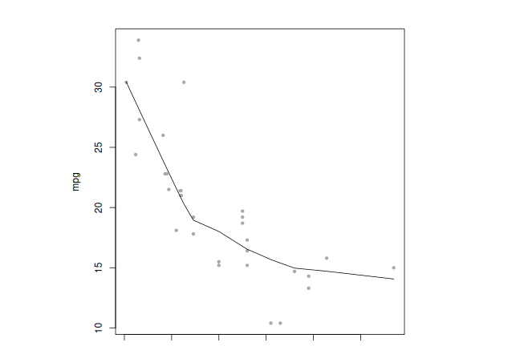

# Knitr
### Code to execute should sit between, while enabling “Run cell” button:

* at least between **\verb`````{r} and ...  \verb`````** (block-scope of course)

``` r
expression <- c("some")
expression
```

```
## [1] "some"
```

* result of evaluation is printed below code block ^^^

* **\verb````` {r setup} ... \verb`````** - for global options setup; shows run cell button too

``` r
knitr::opts_chunk$set(fig.width=9, fig.height=6) # sets up output figs (8 x 6 '')
```

* **\verb````` {r computing} ... \verb`````** - for some math calculations and similar

``` r
x <- 1+1+1 # a simple calculator
set.seed(123)
rnorm(5)  # boring random numbers
```

```
## [1] -0.56047565 -0.23017749  1.55870831  0.07050839  0.12928774
```

* **\verb````` {r graphics} ... \verb`````**  - for plots, graphs etc

``` r
par(mar = c(0.5, 1, 0.5, 1),
    mai = c(0.2, 2, 0.5, 2))
with(mtcars, {
  plot(mpg~hp, pch=20, col='darkgray')
  lines(lowess(hp, mpg))
})
```



### Inline

* Inline R code is also supported, e.g. the value of `x` is 3 // (x here is still from line 20), and 2 &times; &pi;
= 6.2831853.

### Latex / math (no problem...)

* **inline** - LaTeX math as usual: $f(\alpha, \beta) \propto x^{\alpha-1}(1-x)^{\beta-1}$.

* **block size:**
$$
\begin{array}{lllllll}
1 \cdot x_1 &+& 1 \cdot x_2 &+& 2 \cdot x_3  &=&  0 \\ 
1 \cdot x_1 &+& 1 \cdot x_2 &+& 0 \cdot x_3  &=&  1 \\ 
\end{array}
$$

### Code chunks can be nested within eg. lists
1. the area of a circle with radius x    

``` r
    y <- 2
    pi * y^2
```

```
## [1] 12.56637
```
2. OK, that is great

### To compile me, use

``` r
library(knitr)
knit('knitr-how-tos/first-howto-finished.Rmd')
```
